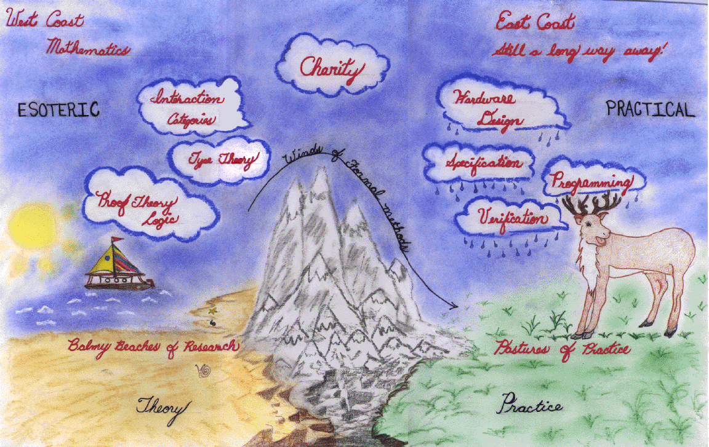

* **The CHARITY Home Page**
* [Latest News](news.md)
* [Frequently Asked Questions](faq.md)
* [License Conditions](license.md)
* [Download The Charity System](system.md)
* [Example Programs](examples.md)
* [The Charity Literature](literature.md)
* [Registration](register.md)
* [Contacting The Charity Development Group](contact.md)
* [Background Information](background.md)

---

The CHARITY Home Page
=====================

> _**NOTE:**  This is an archival version of a [page from the Charity website](http://pll.cpsc.ucalgary.ca/charity1/www/home.html)._

**Charity** is a categorical programming language currently being developed by The Charity Development Group in [The Department of Computer Science](http://www.cpsc.ucalgary.ca/) at [The University of Calgary](http://www.ucalgary.ca/), Canada.

Charity is [functional](http://homepages.inf.ed.ac.uk/wadler/guide.html) in style. That is, programmers familiar with declarative paradigms (functional and logic programmers) should find Charity easy to grasp.

Charity is based on the theory of strong categorical datatypes. These are divided into two subclasses: the **inductive** datatypes (built up by constructors in the familiar way) and the **coinductive** datatypes (broken down by destructors). Programs over these datatypes are expressed by **folds** (catamorphisms) and by **unfolds** (anamorphisms), respectively.

We list some, but not all, of Charity’s features below:

* Charity is “pure”, and supports **lazy evaluation**.
* Charity is **higher-order**.
* All Charity computations **terminate** (up to user input).

It is our belief that Charity provides a very elegant, pure framework for software development, teaching, and language research. This framework supports straightforward reasoning about programs and is highly amenable to program specification, transformation, and verification.

---

_This page © The Charity Development Group 1996 (~~charity@cpsc.ucalgary.ca~~)._  
_Last revised December 1998._
