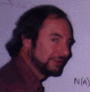

Dr. Robin Cockett
=================

> _**NOTE:**  This is an archival version of a [page from the Charity website](http://pll.cpsc.ucalgary.ca/charity1/www/robin.html)._

Email: ~~robin@cpsc.ucalgary.ca~~, or [~~Home Page~~](http://web.archive.org/web/19990428190416/http://www.cpsc.ucalgary.ca/info/research_brochure/cockett.html)

*... an Englishman of Australian descent ...* — F. W. Lawvere

My research centers on applying category theory to practical problems in computer science. These applications range from the design of programming languages (e.g. **charity**) to the use of interaction categories in the specification and design of distributed and concurrent systems.

The theoretical tools I use include type theory, proof theory, (linear) logic and, of course, fundamentally category theory. I believe that if a diagram does not commute you should not draw it.

I find it fascinating that there are important practical problems to which these often esoteric tools can be applied and enjoy the process of trying to bring them over the mountain ...

*... a sheep in wolf’s clothes ...* — R. Woodrow

Other Charitable People
-----------------------

[Tom Fukushima](fukushima.md), [Dave Spooner](spooner.md), [Barry Yee](yee.md), [Peter Vesely](vesely.md), [Ulrich Hensel](hensel.md), [Marc Schroeder](schroeder.md), and [Charles Tuckey](tuckey.md).

---

Return to the [Charity](background.md) website.
