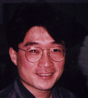

Tom Fukushima
=============

> _**NOTE:**  This is an archival version of a [page from the Charity website](http://pll.cpsc.ucalgary.ca/charity1/www/people/thf.html)._

Email: ~~thf@cpsc.ucalgary.ca~~

Monads are mathematical structures which have been greatly studied by computer scientists of late. Many of the problems which functional languages have, in the past, seemed inadequate at solving seem to have clean solutions when put in the context of a monad. Such issues as comprehensions, I/O, state, and exception handling are among the features which we can now try to implement cleanly. My Ph.D research centers around a monad system for the **charity** programming language. The nice categorical semantics of this language, which is functional in style, suggests a neat way of incorporating this system into our programming paradigm.

Other Charitable People
-----------------------

[Dr. Robin Cockett](cockett.md), [Dave Spooner](spooner.md), [Barry Yee](yee.md), [Peter Vesely](vesely.md), [Ulrich Hensel](hensel.md), [Marc Schroeder](schroeder.md), and [Charles Tuckey](tuckey.md).

---

Return to the [Charity](background.md) website.
