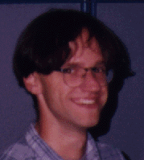

Ulrich Hensel
=============

> _**NOTE:**  This is an archival version of a [page from the Charity website](http://pll.cpsc.ucalgary.ca/charity1/www/people/ulrich.html)._
>
> _Unfortunately, Hensel’s home page has not been included in the Internet Archive._

Email: ~~hensel@cpsc.ucalgary.ca~~, or [~~Home Page~~](http://web.archive.org/web/*/http://pages.cpsc.ucalgary.ca/~hensel/)

I am a visitor from the Department of Computer Science of the [Technische Universität Dresden](http://tu-dresden.de/), Germany. I finished my diploma degree this summer and received a grant by the German Academic Exchange Service (DAAD) for a research stay for one year at the University of Calgary.

My general field of study is specification and verification of software. In order to prove certain properties of programs it is crucial to have a well established formal semantic. There are well-known foundations for different programming paradigm such as those for imperative and functional programming. The object-oriented paradigm is an example of one that lacks a commonly recognized formal foundation.

A formal semantic for the description of systems of concurrent objects should comprise at least two different views on types. On the one hand it is possible to see a type, i.e. a functor, as a signature for an initial datatype. In this case the initial algebra forms the weakest or least solution for the given type equation. Elements of the initial algebra are finite.

On the other hand the formalization of possibly infinite behavior of objects requires infinite structures. The greatest solution of a type equation formed by the terminal coalgebra to the corresponding functor provides tools for the description of the behavior of objects. The carrier set of the terminal coalgebra can be viewed as the collection of the behavior of all automata satisfying the type specification.

The framework of algebras and coalgebras of a functor offers for example a good way to construct objects with an initial datatype as the output alphabet as well as lists of object behavior.

In some cases it is necessary to constrain the behavior of objects, e.g. to specify cyclic or finite behavior. A set of defining equations in addition to the type specification forces the elements of the initial algebra to have the same value. This is reprensented by factorizing the initial algebra with the closure of the set of equations.

If we add defining equations to an object specification we intend to see only those objects whose behavior satisfies the equations. This leads to a reconstruction of the terminal coalgebra in the class of all models of the set of equations. It turns out that a subcoalgebra of the terminal coalgebra without equations can serve as the new terminal coalgebra.

Subcoalgebras of the terminal coalgebra can be seen as safety specifications. However, not all safety specifications in this sense are representable by a finite set of equations. There is a need to establish a richer language to characterize such properties. The extended mu-calculus is able to describe safety and liveness properties for processes of transition systems.

The functional language **charity** developed at this department by [Dr. Robin Cockett](cockett.md) et.al. provides both inductive and coinductive datatypes where the latter coincides with the above object type. It should be possible to use this language to explore our concept and to check it with several examples.

Other Charitable People
-----------------------

[Dr. Robin Cockett](cockett.md), [Tom Fukushima](fukushima.md), [Dave Spooner](spooner.md), [Barry Yee](yee.md), [Peter Vesely](vesely.md), [Marc Schroeder](schroeder.md), and [Charles Tuckey](tuckey.md).

---

Return to the [Charity](background.md) website.
