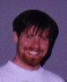

Marc Schroeder
==============

> _**NOTE:**  This is an archival version of a [page from the Charity website](http://pll.cpsc.ucalgary.ca/charity1/www/people/marc.html)._

Email: ~~marc@cpsc.ucalgary.ca~~

I began my graduate studies at the University of Calgary in September of 1994. I completed my undergraduate degree here as well, with a major in Computer Science and a minor in Pure Mathematics.

My interests are now centered around functional programming languages, category theory, formal methods, the theory of computation and its mathematical foundations. While an undergraduate I began working with [Dr. Robin Cockett](cockett.md) on the **charity** programming language, and am now beginning work on adding a module system to the language. This will be the subject of my master’s thesis. My previous work includes the design and implementation of the **charity** Interpreter (CHIRP) alongside [Barry Yee](yee.md). A rewrite with enhanced features, such as pattern matching, is now in the works.

Other experience in industry include a summer position held at the National Research Council doing work in AI, and graphics work on a video game for a fledgling games company here in Calgary. Some of my interests outside the field are rock climbing, caving, biking, reading, philosophy, playing bass and guitar, and volunteering as a jazz D.J. for our campus radio station.

Other Charitable People
-----------------------

[Dr. Robin Cockett](cockett.md), [Tom Fukushima](fukushima.md), [Dave Spooner](spooner.md), [Barry Yee](yee.md), [Peter Vesely](vesely.md), [Ulrich Hensel](hensel.md), and [Charles Tuckey](tuckey.md).

---

Return to the [Charity](background.md) website.
