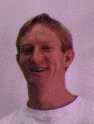

Dave Spooner
============

> _**NOTE:**  This is an archival version of a [page from the Charity website](http://pll.cpsc.ucalgary.ca/charity1/www/people/dave.html)._
>
> _All documents are available in PDF._

Email: ~~spoonerd@cpsc.ucalgary.ca~~, or [~~Home Page~~](http://web.archive.org/web/*/http://pages.cpsc.ucalgary.ca/~spoonerd/)

Papers
------

* R. Cockett and D. Spooner, Categories for synchrony and asynchrony ([PDF](pdf/more/cockett-1995.pdf))
* R. Cockett and D. Spooner, Constructing process categories ([final PDF](pdf/more/cockett-1997a.pdf), [PDF](pdf/more/cockett-1996.pdf))
* R. Cockett and D. Spooner, SProc categorically ([PDF](pdf/more/cockett-1994.pdf))
* D. Spooner, Building Process Categories ([PDF](pdf/more/spooner-1997.pdf))

Other Charitable People
-----------------------

[Dr. Robin Cockett](cockett.md), [Tom Fukushima](fukushima.md), [Barry Yee](yee.md), [Peter Vesely](vesely.md), [Ulrich Hensel](hensel.md), [Marc Schroeder](schroeder.md), and [Charles Tuckey](tuckey.md).

---

Return to the [Charity](background.md) website.
