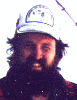

Charles Tuckey
==============

> _**NOTE:**  This is an archival version of a [page from the Charity website](http://pll.cpsc.ucalgary.ca/charity1/www/people/charlie.html)._
>
> _Unfortunately, the University of Calgary has prevented Tuckey’s home page from being included in the Internet Archive._




Email: ~~tuckey@cpsc.ucalgary.ca~~, or [~~Home Page~~](http://web.archive.org/web/*/http://pages.cpsc.ucalgary.ca/~tuckey/)

Charles received his BSc. from the University of Calgary in 1994. He is currently pursuing a Master’s degree.

In the functional programming paradigm one often wants to apply different versions of a function depending on the value of its input parameters. This can be done by testing each input explicitly and taking appropriate action based on its value. However this can result in code that is bulky and difficult to read. A preferable method is to use pattern matching. With this method each version of a function is guarded by a “pattern”. At run time the version of the function with a “pattern” matching the input is executed.

Pattern matching does not change the computational power of a language but it does enhance the programmer’s ability to generate (correct) programs that are easier to read and understand. The improvement pattern matching provides in these areas is great enough that implementations of Lisp, SML, Miranda and many other functional languages provide the ability to do pattern matching. Thus, if **charity** is to be accepted as a mainstream functional type language with practical application, it is necessary to add pattern matching to its list of features.

My research is centered around implementing pattern matching in the **charity** programming language. Implementing pattern matching will involve developing an extended term logic, a usable syntax and a term logic type checker. In addition a translation from the extended term logic to the core term logic will be required. Finally, there is an opportunity to optimize generated core term logic code through the use of decision trees.

A small example of pattern matching written in **charity** syntax is given below. A function to evaluate a boolean AND written without pattern matching,

```
>  def and(x, y) = { true  => { true  => true
+                             | false => false
+                             } (y)
+                  | false => false
+                  } (x).
and  : bool * bool -> bool
```

The same function with pattern matching,

```
>  def and'(x, y) = { (true,  true)  => true
+                   | (true,  false) => false
+                   | (false, _)     => false
+                   } (x, y).
and'  : bool * bool -> bool
```

The same function written even more succinctly with pattern matching,

```
>  def and''(x, y) = { (true, true) => true
+                    |  _           => false
+                    } (x, y).
and''  : bool * bool -> bool
```


Other Charitable People
-----------------------

[Dr. Robin Cockett](cockett.md), [Tom Fukushima](fukushima.md), [Dave Spooner](spooner.md), [Barry Yee](yee.md), [Peter Vesely](vesely.md), [Ulrich Hensel](hensel.md), and [Marc Schroeder](schroeder.md).


---

Return to the [Charity](background.md) website.
